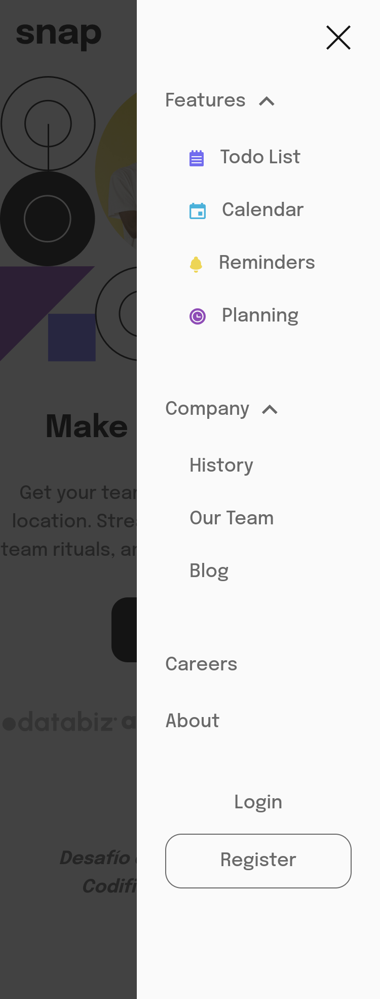
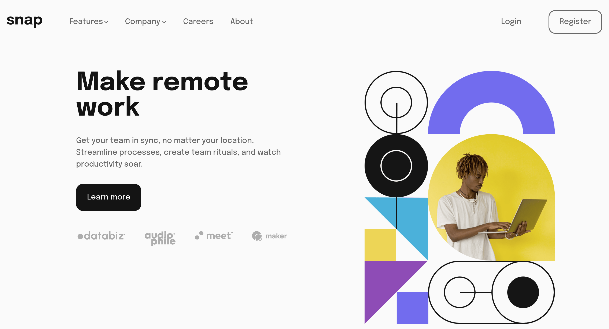
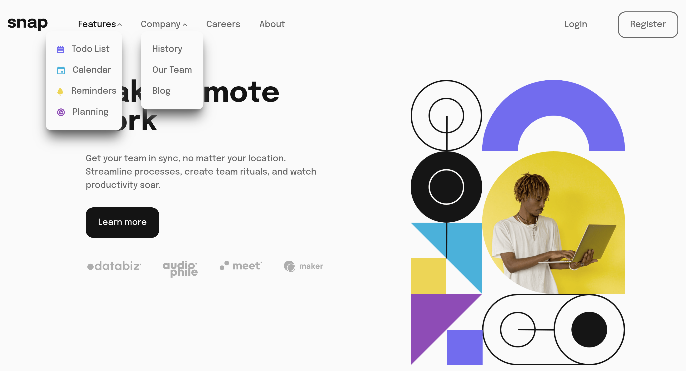

# Solución al desafío "Intro Section With Dropdown Navigation"

## Introducción

Solución al desafío de Frontend Mentor hecho con Tailwindcss

## Mi Proceso

### Tecnologías

- Flexbox
- Enfoque "Mobile First"
- Postcss
- Tailwindcss
- HTML

### ¿Que aprendí?

La creación del menú desplegable en mis proyectos de desarrollo web representó un desafío significativo que, aunque superé, no estuvo exento de dificultades. Hasta el punto que estaba haciendo malabares para que funcionara.

Es algo en lo que tengo que ir mejorando.

### Screenshots

#### Mobile

375px

##### Sin Menú


##### Con Menú



#### Desktop

1440px

##### Sin Menús



##### Con Menús



## Instalación

Basta con clonar este repositorio en tu maquina local.

```text
git clone https://github.com/SaulOrlando/intro-section-with-dropdown-navigation.git
```

## Autor

- [Github](https://github.com/SaulOrlando)
- [Frontend Mento](https://www.frontendmentor.io/profile/SaulOrlando)
